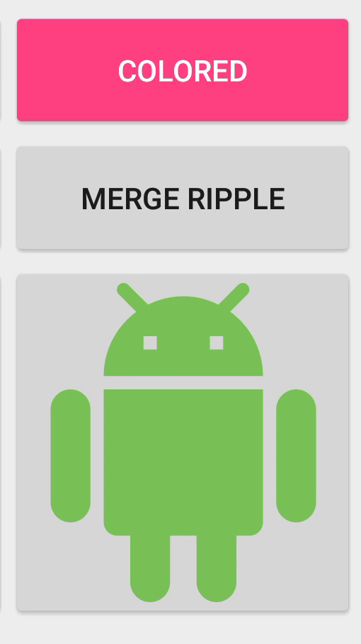

# RaiflatButton

A raised button that lowers down to 0dp of elevation.

It behaves like a normal button on APIs < 21



## Build

I'll upload it to jcenter in the next couple of days.
For now, you can just test the sample.

## How to

Just add the following xml to your layout:

```xml
<com.github.rubensousa.raiflatbutton.RaiflatButton
    android:id="@+id/normalButton"
    style="@style/Base.Widget.AppCompat.Button.Colored"
    android:layout_width="wrap_content"
    android:layout_height="wrap_content"
    android:text="Colored" />
    
<com.github.rubensousa.raiflatbutton.RaiflatImageButton
    android:id="@+id/imageButton"
    style="@style/Base.Widget.AppCompat.Button"
    android:layout_width="wrap_content"
    android:layout_height="wrap_content"
    android:src="@drawable/ic_android" />
```

If you want to resume the normal button behavior, just use:


## Styling

Since RaiflatButton and RaiflatImageButton both extend AppCompatButton and AppCompatImageButton, you can reuse the same styles.

Example:

```xml
<style name="RaiflatButtonPrimaryStyle" parent="Base.Widget.AppCompat.Button.Colored">
    <item name="android:colorControlNormal">?attr/colorPrimary</item>
</style>
```

## License

    Copyright 2016 Rúben Sousa
    
    Licensed under the Apache License, Version 2.0 (the "License");
    you may not use this file except in compliance with the License.
    You may obtain a copy of the License at
    
        http://www.apache.org/licenses/LICENSE-2.0
    
    Unless required by applicable law or agreed to in writing, software
    distributed under the License is distributed on an "AS IS" BASIS,
    WITHOUT WARRANTIES OR CONDITIONS OF ANY KIND, either express or implied.
    See the License for the specific language governing permissions and
    limitations under the License.
